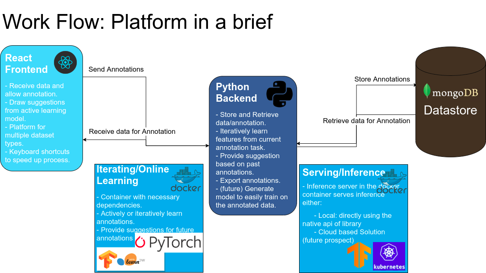

Mentors:

- Carlos Fernandez

Ratin Kumar
Email: [ratin.kumar.2k@gmail.com](mailto:ratin.kumar.2k@gmail.com)  
Phone: +91-9896225424

## Index

1. [Introduction](#introduction)
2. [Synopsis](#synopsis)
3. [Project Goals](#project-goals)
4. [Timeline](#timeline)
5. [Deliverables](#deliverables)
6. [References](#references)

## Introduction

## Personal Information
|           |                                                              |
| --------- | ------------------------------------------------------------ |
| Full Name | Ratin Kumar                                                  |
| Institute | 2nd Year B.Tech StudentComputer Science and EngineeringNational Institute of Technology Kurukshetra |
| Email     | [ratin.kumar.2k@gmail.com](mailto:ratin.kumar.2k@gmail.com)[ratin_11822004@nitkkr.ac.in](mailto:ratin_11822004@nitkkr.ac.in) |
| Phone     | +91-9896225424                                               |
| Blog      | [https://medium.com/@ratin.kumar.2k](https://medium.com/@ratin.kumar.2k) |
| Github    | [https://github.com/DumbMachine](https://github.com/DumbMachine) |
| Skype     | RatinKumar                                                   |
| IRC Nick  | DumbMachine (Freenode)                                       |
| Timezone  | Indian Standard Time (GMT +0530)                             |
| Address   | 317, Abhimanyu Bhavan Hostel-6, NIT campus,National Institute of Technology Kurukshetra, Kurukshetra, Haryana, India 136119 |
| Reference Contact | Prathamesh ApteEmail: [aptep.1976@rediffmail.com](mailto:aptep.1976@rediffmail.com)Phone: +91-8107407676 |
| ----------------- | ------------------------------------------------------------ |
|                   |                                                              |

## About Me
I am Ratin Kumar, a 2nd-year undergraduate Computer Engineering student at National Institute of Technology Kurukshetra. I have good experience of using Python and Javascript for creating applications or just some hacky scripts to get things done. I really enjoy coding all the time, because of which I have numerous small projects on my Github.

Riding cycle, stalking stock trends and competitive FPS games are some of my interests outside of the world of programming.

### Open Source
I am part of many organizations on Github and have made multiple minor and a few major contributions. I love the spirit of Open Source, promoting universal access to code, and thus have become the part of this amazing community. Being a part of the Open Source group at my College, I have organized workshops on GIT and using Machine Learning for Image Captioning and continually help colleagues.

### Skills
* Good knowledge of using Python and some knowledge of the internals of Python.
* Knowledge of Data Science.
* Good background in Mathematics; Calculus and Linear Algebra.
* Comfortable with using GIT or any other similar service.

Project `redacted`**

## Abstract

The field of Artificial Intelligence is helping advancement of many fields. AI is relevant to any intellectual task. Modern artificial intelligence techniques are pervasive and are too numerous to list here. Some of the prominent examples range from `something `autonomous vehicles to life saving by helping in medical diagnosis. Apart from the aforementioned serious, AI is used in entertainment industry whether it maybe using AI to create articles or create deepfakes. The world has also seen AI being used to detect the wrongs in our society, like fake news and also to detect the wrongs by AI itself (eg deepfakes).

At the heart of most AI solutions lies requirement of **labeled data**. The lack of  labeled data makes impossible for the algorithm to learn the regularities and patterns in data. Labeling data, manually, is cumbersome and time consuming. AI solutions can be divided in two categories:

- Totally new
- Derivative of something 

Project `redacted` aims at providing a platform to simplify and speedup the process of data labeling by making use of automation tools and pre-trained machine learning models. This project will provide a simple gui to users for annotating data required by various machine learning tasks (computer vision based, nlp based or audio based) and make use of pre-trained models and some techniques (mentioned in implementation details section)  to allow automation of annotation to as far extent as possible. The gui will be supported by a `python` backend responsible for all preprocessing/recommendation for annotation and also storage of annotations received by the frontend.

## Background

CCExtractor, initially a small project, has now embedded itself firmly into large corporations and prestigious universities where it is used for many educational feats. This project will help fuel the fire of AI boom. It will introduce a tool to all the machine learning practitioners, which will allow them to annotate data a lot faster than before.

## Motivation

World of Artificial Intelligence has made big leaps in providing humans the power to find patterns in data. It will be the basis of most of the automation in the coming century, to keep this field expanding it requires data. Data, in its raw form, is available readily. This data accompanied with the right tool, which should focus on automatic and fast annotation, will improve efficiency of practitioners. Reduction of time spent annotating data implies increase in the time spent on finding solutions of real world problems.

## Project `redacted`

To accomplish this project's aims, a simple gui and a powerful backend which learns from past annotations are required. The gui will be simple and only expose those functions that are required and allow for usage of keyboard shortcuts to allow for reaching peak of efficiency of the manual annotators. The accompanying backend will actively learn from the annotations to suggest the annotations to users passively. This passive suggestion for manual annotators will mean no amount will be spend on annotation for correct suggestion and ignoring the suggestion, if wrong hence being a **passive suggestion**. Currently the benefits that will served from this project can be condensed to:

- Increase in speed and efficiency of manual annotators.
- Increase the amount of annotated data, as annotation tasks' difficulty and time investment decreases.
- Any more points?

`redacted` will allow institutes, professional or any interested party to annotate data fast and easily, leaving the party with more time for implementation of solution.

## Why do I want to Build `redacted`?

#### Why `redacted`?

Make the world more productive.

#### Why CCExtractor?

Mentor gave me the opportunity.

## Proposed Deliverables for GSOC

1. A simple react-based frontend, allowing for ingestion of the following:

   1. Computer-Vision based datasets for:

      - Image/Video Classification
      - Image Key points
      - Object Detection
      - Instance Segmentation
      - Action Recognition
      - Video Segmentation

   2. Natural-Language Processing based datasets for:

      - Classification

      - Named Entity Recognition

      - QnA

      - Machine Translation

      - Sentiment Analysis (sentiment slider)

      - Custom tasks ( like transliteration )

   3. Audio based datasets for:

      - Audio Transcription
      - Audio Segmentation
      - Audio Classification

2. A robust backend which will take care of:

   - Send data for annotation to frontend
   - Saving annotations received from frontend 
   - Export annotations to format allowing for ingestion from AutoML things, Detectron2 and Tensorflow Object Detection API and Our custom thing.
   - An active learning model, which will improve with each annotation and also provide suggestions for annotations.
   - Maintain metrics

3. Tests and Continuous Integration tools.

4. Detailed documentation; for users as well as developers.

5. Fortnightly blogs on developmental advances and milestones.

6. Setting the ground for a Model Zoo things, to allow ingestion of Annotations and train models. Possible integration with Rekognition.

## Brief Tentative Working

Brief show of the workflow

## Detailed Working And Implementation

# Timeline

| Duration              | Task                                                         |
| --------------------- | ------------------------------------------------------------ |
| March 27              | **Deadline for submitting Project Proposal**                 |
| March 27 - April 23   | Learn more about Ganga Toolkit.Read Documentation and learn more about HTCondorLearn more about Jupyter Notebook. |
| April 23 - May 14     | **Official Community Bonding Period**Get Involved with CERN, HTCondor and Jupyter community.Know more about mentors such as their timezone, preferred medium of communication etc.Learn about other projects and ongoing experiments at CERN.Get acquainted with various tools used at CERN.**Begin Task 1 : Design and Implement Plugin**Figure out prototype and plan how the plugin will work.Set up development environment. |
| May 14 - June 6       | **Official Coding Period Start**Finish implementation of pluginTest the plugin to some sample jobs on local backend server.Perform UI tests and fix bugs. |
| June 6 - June 11      | Time period for any unexpected delay.**Finish Task 1**       |
| June 11 - June 15     | **Phase 1 evaluation**Submit git repository of Code with documentation for Task 1 |
| June 15 - July 4      | **Begin Task 2 : Integrate plugin with HTCondor**Implement functionality for integrating HTCondor as backend.Test plugin for real batch jobs at CERN.Ask for feedbacks from the users and implement suggestions. |
| July 4 - July 9       | Time period for any unexpected delay.**Finish Task 2**       |
| July 9 - July 13      | **Phase 2 evaluation**Submit git repository of Code with documentation for Task 2 |
| July 13 - August 10   | **Begin Task 3 : Deploy plugin to CERN IT Infrastructure**Test plugin on CERN’s batch infrastructure.Integrate plugin to SWAN Notebook service.Ask feedback from the users and implement suggestions. |
| August 10 - August 14 | **Finish Task 3** **Final Submission**Submit git repository of final code with complete documentation. |

## Additional Information Regarding Timeline

- The timeline gives a rough idea of my planned project work. Best efforts will be made to follow the proposed schedule. I believe that I will be able to achieve all the milestones for this project, as it aligns with my interest and trying to do something innovative. 
- I’ve no other commitments during summer and hence, will be able to dedicate 48 hours to 60 hours a week. During the last month of the project, my college will begin and I’ll be denoting around 28-30 hours a week. `this might be for testing and polishing`.
- Each week, time will be divided (according to workload) amongst planning, learning, coding, documenting and testing features. Except for the developer’s guide, all documentation will go hand in hand with the development. This will help to keep a profound grasp over the code implementation and working, minimizing bugs in the later stages.
- Weekends will be mostly dedicated to testing, bug fixing, and blog writing. Fortnightly blogs will be maintained at https://medium.com/@ratin.kumar.2k and will include highlights of the development process and also methods used to overcome hurdles.
- I’m very enthusiastic about working on this project as it has been on my mind for a long time. It has potential to help in `thing of AI`. 

## Requirements

- **Remote High-Speed Server**: Although

# Deliverables

- A functional frontend
- Fully modular and feature-rich backend which learns annotations while users perform actions.
- Simple pipeline for training `Classification` and `Object Detection`.

## Working Environment And Schedule

I’ll be working full-time on the code on weekdays. On weekends, I’ll be focusing on documentation, testing and bug fixing. My awake hours would usually be in between 6:30 AM IST (1:00 AM UTC) to 2 AM IST the next day (8:30 PM UTC) and I’m comfortable working anytime during this period but I can easily tune my working hours if circumstances ask for it. Except for a few days of traveling (which I’ll be informing in advance to my mentor), I’ll be having no other absences. In case of emergencies, I'll be informing my mentor.

I'll be working from either my house or hostel, both the places have access to good internet. 

I’m very flexible with my schedule and already have the habit of working at night and hence timezone variation (with my mentor) won’t be an issue. I’m comfortable with any form of communication that suits my mentor.

## Post-GSOC Plans

- 

## Future Prospects:

- Building a extension to this project to bring support for training models using standard or sota models.
- Build a complete pipeline to allow laymen to train machine learning models and then export in standard forms.

# **References**:

This is a work in progress.