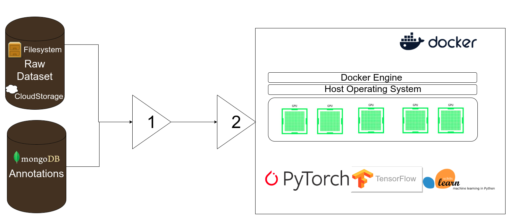

# Project Redacted

Mentors:

- Carlos Fernandez

Ratin Kumar
Email: [ratin.kumar.2k@gmail.com](mailto:ratin.kumar.2k@gmail.com)  
Phone: +91-9896225424

## Index

1. [Introduction](#introduction)
2. [Synopsis](#synopsis)
3. [Project Goals](#project-goals)
4. [Timeline](#timeline)
5. [Deliverables](#deliverables)
6. [References](#references)

## Introduction


## Personal Information
|           |                                                              |
| --------- | ------------------------------------------------------------ |
| Full Name | Ratin Kumar                                                  |
| Institute | 2nd Year B.Tech StudentComputer Science and EngineeringNational Institute of Technology Kurukshetra |
| Email     | [ratin.kumar.2k@gmail.com](mailto:ratin.kumar.2k@gmail.com)[ratin_11822004@nitkkr.ac.in](mailto:ratin_11822004@nitkkr.ac.in) |
| Phone     | +91-9896225424                                               |
| Blog      | [https://medium.com/@ratin.kumar.2k](https://medium.com/@ratin.kumar.2k) |
| Github    | [https://github.com/DumbMachine](https://github.com/DumbMachine) |
| Skype     | RatinKumar                                                   |
| IRC Nick  | DumbMachine (Freenode)                                       |
| Timezone  | Indian Standard Time (GMT +0530)                             |
| Address   | 317, Abhimanyu Bhavan Hostel-6, NIT campus,National Institute of Technology Kurukshetra, Kurukshetra, Haryana, India 136119 |
## About Me
I am Ratin Kumar, a 2nd-year undergraduate Computer Engineering student at National Institute of Technology Kurukshetra. (I will update this later, currently focusing on more important things)

# Project `redacted`

## Abstract

The field of Artificial Intelligence is helping advancement of many fields. AI is relevant to any intellectual task. Modern artificial intelligence techniques are pervasive and are too numerous to list here. Some of the prominent examples range from `something `autonomous vehicles to life saving by helping in medical diagnosis. Apart from the aforementioned serious, AI is used in entertainment industry whether it maybe using AI to create articles or create deepfakes. The world has also seen AI being used to detect the wrongs in our society, like fake news and also to detect the wrongs by AI itself (eg deepfakes).

At the heart of most AI solutions lies requirement of **labeled data**. The lack of  labeled data makes impossible for the algorithm to learn the regularities and patterns in data. Labeling data, manually, is cumbersome and time consuming. AI solutions can be divided in two categories:

- Totally new
- Derivative of something 

Project `redacted` aims at providing a platform to simplify and speedup the process of data labeling by making use of automation tools and pre-trained machine learning models. This project will provide a simple gui to users for annotating data required by various machine learning tasks (computer vision based, nlp based or audio based) and make use of pre-trained models and some techniques (mentioned in implementation details section)  to allow automation of annotation to as far extent as possible. The gui will be supported by a `python` backend responsible for all preprocessing/recommendation for annotation and also storage of annotations received by the frontend.

## Background

CCExtractor, initially a small project, has now embedded itself firmly into large corporations and prestigious universities where it is used for many educational feats. This project will help fuel the fire of AI boom. It will introduce a tool to all the machine learning practitioners, which will allow them to annotate data a lot faster than before.

## Motivation

World of Artificial Intelligence has made big leaps in providing humans the power to find patterns in data. It will be the basis of most of the automation in the coming century, to keep this field expanding it requires data. Data, in its raw form, is available readily. This data accompanied with the right tool, which should focus on automatic and fast annotation, will improve efficiency of practitioners. Reduction of time spent annotating data implies increase in the time spent on finding solutions of real world problems.

## Project `redacted`

To accomplish this project's aims, a simple gui and a powerful backend which learns from past annotations are required. The gui will be simple and only expose those functions that are required and allow for usage of keyboard shortcuts to allow for reaching peak of efficiency of the manual annotators. The accompanying backend will actively learn from the annotations to suggest the annotations to users passively. This passive suggestion for manual annotators will mean no amount will be spend on annotation for correct suggestion and ignoring the suggestion, if wrong hence being a **passive suggestion**. Currently the benefits that will served from this project can be condensed to:

- Increase in speed and efficiency of manual annotators.
- Increase the amount of annotated data, as annotation tasks' difficulty and time investment decreases.

`redacted` will allow institutes, professional or any interested party to annotate data fast and easily, leaving the party with more time for implementation of solution.


## Proposed Deliverables for GSOC

1. A simple react-based frontend, allowing for ingestion of the following:

   1. Computer-Vision based datasets for:

      - Image/Video Classification
      - Image Key points
      - Object Detection
      - Instance Segmentation
      - Action Recognition
      - Video Segmentation

   2. Natural-Language Processing based datasets for:

      - Classification

      - Named Entity Recognition

      - QnA

      - Machine Translation

      - Sentiment Analysis (sentiment slider)

      - Custom tasks ( like transliteration )

   3. Audio based datasets for:

      - Audio Transcription
      - Audio Segmentation
      - Audio Classification

2. A robust backend which will take care of:

   - Send data for annotation to frontend
   - Saving annotations received from frontend 
   - Export annotations to format allowing for ingestion from AutoML things, Detectron2 and Tensorflow Object Detection API and Our custom thing.
   - An active learning model, which will improve with each annotation and also provide suggestions for annotations.
   - Maintain metrics

3. Tests and Continuous Integration tools.

4. Detailed documentation; for users as well as developers.

5. Fortnightly blogs on developmental advances and milestones.

6. Setting the ground for a Model Zoo things, to allow ingestion of Annotations and train models. Possible integration with Rekognition.

## Brief Tentative Working

Brief show of the workflow

## Detailed Working And Implementation


The project can be divided into the following components:

- **React based frontend**: The frontend webapp, will be the component most users see and use. 
- **Python based backend**: The server responsible for providing data to react app and taking annotation data from it. The iterative learning model, which will give real time suggestions of annotations, will also be backend's responsiblity. To increase the modularity of backend's components, the following division is recommended:
  - **Docker Container**: Machine Learning frameworks have alot of dependencies and can be hard to locally setup. To overcome this, all the functioning related to inference and learning will be done from the container.
  - **Datastore**: Making use of local filesystem to store the annotations. The annotations will have option to be exported into contemporary formats and then be saved on the local fs.
  - **Server**: To listen and respond to requests of react app, while also controling the above to components. 

Let's look at the components in more detail:

### React-based Frontend:

(Mockups of the proposed frontend)


(mockup for audio and video under process)

The project will come bundled together. The python server will come with a cli tool to startup all the necesarry. Starting all the necessary components will be as easy as:

```bash
# Registering a new dataset
$ project-redacted create --dataset <dataset_name> --data_directory <directory>
# Starting the server
$ project-redacted start --config <config_file>
```

A config file will be essential in providing information necessary for the functioning, a default config will look like:

```yaml
# config.yaml
init: False # flag to initialize new dataset repo
dataset_name: "default_dataset"

# data related options
data_directory: <current_directory>
annotation_directory: <current_directory>/annotations
export_format: "detectron2" # support for standard format from the industry

# Problem related options
problem_field: "computer-vision"
problem_sub_field: "classification"
classification_categories:
	- aeroplane
	- airport personnel
	- shuttle bus
	- luggage carrier

# Iterative Learning related options
train: "true"
training_approach: "iterative_learning" # ∈ ["iterative_learning", "multi_onevsall_classifiers"]
train_size: "1000" # max samples from each class for training model
train_split: "0.1"  # At what proportions of train_size to retrain
augmentation: "True" # prevent overftting and increase robustness of model
train_framework: "sklearn" # ∈ ['sklearn', 'tensorflow/pytorch']
train_acc_threshold: 0.4 # Only serve suggestions if model is able to achive this accuracy 

# Miscellaneous options
user_name: "dumbmachine"
frontend_theme: "dark" # ∈ ['light', 'dark']
```

Using the config all the necassary variables will be initialized and allow for proper communitcation between frontend and backend.

Once started, the frontend will greet the user with types of annotations available unless stated in the `config_file` . After choosing the necessary task, the `react-app`will request data from `python-backend` which serve the request by fetching data from `data_directory` field in the `config_file`. Upon successful annotation of data, `react-app` will `post` the annotation metadata to `python-backend`and request for further data. This cycle will continue until `train_split` precentage of data points are not annotated.

(mockup, circular saving )

When `train_split` percent of data points have become annotated, `python-backend` will start learning annotations to provide _suggestions_. After training, the cycle of data annotation will change: when `react-app` asks for `data` for annotation it receives `(data, prediction)` where `data` is the data requested and `prediction` is the suggestion. On each multiple of `train_split`, the model will train with the new data to update its knowledge of annotations and increase accuracy.

The primary component will execute `fn` `getIniData()` when the component mounts 

```javascript
# home_component: Details left out to maintain brevity.
import React from 'react';
import ReactDOM from 'react-dom';
import axios from 'axios';

class home_demo extends React.Component {
    # initially all state vars dummy
    state = {
        dataset_name: "default_dataset" # name of the current working dataset
        iter: 0, # index of data to be asked for 
        data: [], # data to be received from python-server for annotation
        annotations: "", # annotation of the above mentioned data
        suggestion: "" # suggestion for the data
    }

	componentDidMount(){
        axios.get(`<localhost>/dataset/${this.state.dataset_name}?id=${this.state.iter}`)
        	.then(res => {
            const data = res.data.data;
            const suggestion = res.data.suggestion;
            this.setState({data, suggestion});
        });
    }

	sendAnnotations(){
        axios.post(
        `<localhost>/dataset/${this.state.dataset_name}`,
        {iter, annotations})
            .then(res => console.log(res))
        	.catch(err => console.log(err))
    }
	......
    ......
}
```


## Python-based Backend:

I propose the following structure for python-related code:

```bash
# NOTE: Some details are left out to maintain brevity.
. <source_dir>
  |-react_app
  | |-public
  | |-src
  | | |-components
  | | | | App.js
  | | | | App.css
  |-python-server
  | |-server
  | | |-server.py
  | | |-server_utils.py
  | |-cli
  | | |-cli.py
  | | |-cli_utils.py      
  | |-active_learning
  | | |-server.py
  | | |-server_utils.py      
```

`Python` on the backend will be responsible for:

- `server`:  The module will be responsible for catering to the requests of `react-app` and calling the `active_learning` module for learning patterns from annotated data. Main responsibilities are:

  - serving requests of data of `react-app`.
  - saving `annotations` in the required `export_format`.
  - giving data to `docker container` for actively learning from annotations.

  

  ```python
  # flask_server: Details left out to maintain brevity.
  from ml_algorithms import suggestion
  
  # Register a new dataset        
  @app.route('/create', methods=['GET'])
  def register_dataset_handler():
      ....
  # Endpoint for `getting` data or `putting` annotations 
  @app.route('/dataset/<dataset_name>', methods=['GET', 'POST'])
  def annotation_handler():
      # react-app is asking for data
      if request.method == "GET": 
          return (dataset_generator(dataset_name, idx), suggestion(dataset_name, idx))
      # react-app is giving the annotation
     	else:
          idx = request.form.get('iter')
          annotation = request.form.get('annotation')
          save_annotation(
              dataset_name.
              annotation, idx
          )
          
  def train_model(...):
  ```

  

- `cli_tools`: This module will implement the `cli` for starting and controlling the service.

  ```bash
  # Registering a new dataset
  $ project-redacted create --dataset <dataset_name> --data_directory <directory>
  # Starting the processes
  $ project-redacted start --config <config_file>
  # Continue from previous work
  $ project-redacted continue --config <config_file>
  # Create a config file
  $ project-redacted create_config 
  ```

- `active_learning`: This module holds the responsibilites of training a model in the background to produce confident suggestions for annotations on new data. Following methods will be employed for learning:

  - Algorithmic: These do not employ machine learning based solutions. Making use of general algorithms, that are many times used in conjunction with ml techniques. Further details are provided below, where I mention in details about the techniques for each individual  task of annotations.
  - Machine Learning: These employ machine learning solutions to directly learn trends in data or by using representations of data to learn trends.

Currently the following are tasks that support iterative or active learning:

###    Computer Vision Tasks:

- **Image Classification**:  Two methods will supported for actively learning annotations:

  1. *Simple classifier (or simple classifier on top of pre-trained model):* Here a model will be trained in background on each iteration where number of samples for each class reaches a multiple of `train_split`threshold. Even distribution inhibits the suggestion model from overfitting or biasing. Advantages of this approach are better suggestion and lighter on resource usage. But disdvantages of this approach is :

     - Only trains model when each category has enough samples, this might not happend uniformly in real world cases.
     - Dataset might have a skewed distribution.

     These issues can be tackled by intensive augmentation to try and balance class distributions or allow user to submit a model for usage in *iterative learning*. This might have the benefit of prior knowledge if user has a model categoring to the dataset. 

     A sample for this model can be found in [this notebook](https://www.kaggle.com/ratinkumar/poc-iteration/edit). Where a model is trained in iterations of 100 samples per class for a total of 5 cycles.This implies a model trained on only 3000(6 classes x 500 images each) images out of 25k images,

     

     (There is a spelling mistake on this graph)

  2. *OneVsAllClassifier*:  `n` models will be trained, where `n` corresponds to the number of classes in the classification problem. This will require more resources for inference and training but has the advantage of allowing support for skewed classes.

     (I will link the poc here)

- Object Detection: 

  - Making use of pre-trained models to train on subset of data for which annotations become available. The benefit of using a pre-trained model can be seen with the below examples:

    Note: The below images are result of training tensorflow object detection api using mobilenet on only a set of 20 images, for reference look at [this notebooks](https://colab.research.google.com/drive/15xa-RS3jerXLB3Yw223woppIYN9epO-4#scrollTo=SFQYOYMFmm1n)

    First image displays that models help reduce the total number of annotations to be manually done.

    

    Second image displays that even if suggested annotation is wrong, the model correctly drew the bounding box.

    

  - Instance Segmentation and Key Points: These will also take an approach similar to above, i.e they will make use of iterative: training on pre-trained models. 

    - The user will also have a choice to use a custom tool which can isolate object using their colors. This tools converts the image colors to `HSV` and tries to isolate specific colors by setting `low,high` ranges.

      

    For reference : https://colab.research.google.com/drive/1wDoeNGxZOI0Q0YlhFVTe0pI8hi7TuWc9

###    Natural Language Processing:

- Full Support:

  - NER, Classification, Sentiment Analysis: Two option will available to the user, initially: either make use of tfidf transformers and learn occurrences of works. Or make use of `word2vec` or `bert` to get representations of words and treat it like a normal classification problem.

    By making use of tfidf vectors, a model can learn what category of words are more probable of occuring as a particular category in NERs. An example:

    For classification and sentiment analysis using `word2vec` to obtain vector representation of words and sentences to make a regression model proves suffice.

    (I will update the POC for this soon)

- Partial Support:

  - Paraphrase detection and other similar tasks: Weak suggestions can be made in other nlp task by learning trends of occurances of words in data. But these may not offer any real world advantage. This is still under testing

###    Audio Tasks:

- Classification, Segmentation and Tagging: By either making use of pre-trained vectors to obtain vectors from irregular length audio clips for use as features for regression models or generating own features by analyzing the audio wave histogram.
- (POC for this will be uploaded soon)

### Major Dependencies

- **ReactJs**
- **Sklearn**
- **Tensorflow**/**Pytorch**
- **Docker**
- **Flask**
- **Travis** **CI**

#  Timeline

| Duration              | Task                                                         |
| --------------------- | :----------------------------------------------------------- |
| March 31              | **Deadline for submitting Project Proposal**                 |
| March 31 - April 27   | **Application Review Period**                                |
| April 27 - May 18     | **Official Community Bonding Period**                        |
| May 18 - June 12      | **Official Coding Period Start** <br>**Begin Task 1:**<br>Finish implementation of `react-app` and a simple data loading `python-server`. <br>Test `react-app` on samples using local backend server.<br>Perform UI tests and fix bugs. |
| June 12 - June 15     | Time period for any unexpected delay.<br>**Finish Task 1**   |
| June 15 - June 19     | **Phase 1 evaluation**<br>Submit git repository of Code with documentation for Task 1 |
| June 19 - July 10     | **Begin Task 2 : Implement Active Learning**<br/>Implement functionality for integrating active/iterative learning and dataloaders<br>Ask for feedbacks from the users and implement suggestions. |
| July 10 - July 13     | Time period for any unexpected delay.<br/>**Finish Task 2**  |
| July 13 - July 17     | **Phase 2 evaluation**<br/>Submit git repository of Code with documentation for Task 2 |
| July 17 - August 7    | **Begin Task 3 : Complete Integration**<br/>Complete the integration of `react-app` and `python-server`.<br>Implement basic pipeline to allows users to train on data using standard models.<br>Ask feedback from the users and implement suggestions. |
| August 7 - August 10  | **Phase 3 evaluation**<br/>Submit git repository of Code with documentation for Task 3 |
| August 10 - August 17 | **Finish Task 3** **Final Submission<br/>**Submit git repository of final code with complete documentation. |


## Additional Information Regarding Timeline

- The timeline gives a rough idea of my planned project work. Best efforts will be made to follow the proposed schedule. I believe that I will be able to achieve all the milestones for this project, as it aligns with my interest and trying to do something innovative. 
- I’ve no other commitments during summer and hence, will be able to dedicate 48 hours to 60 hours a week. During the last month of the project, my college will begin and I’ll be denoting around 28-30 hours a week. `this might be for testing and polishing`.
- Each week, time will be divided (according to workload) amongst planning, learning, coding, documenting and testing features. Except for the developer’s guide, all documentation will go hand in hand with the development. This will help to keep a profound grasp over the code implementation and working, minimizing bugs in the later stages.
- Weekends will be mostly dedicated to testing, bug fixing, and blog writing. Fortnightly blogs will be maintained at https://medium.com/@ratin.kumar.2k and will include highlights of the development process and also methods used to overcome hurdles.
- I’m very enthusiastic about working on this project as it has been on my mind for a long time. It has potential to help in `thing of AI`. 

## Requirements

- **Remote High-Processing Server**: A machine capable of servicing gpu loads of contemporary machine learning tasks. Getting access to this would be appreciated but is not a necessity for successful execution of this project. 

## Previous Contributions

- [Swag lyrics](https://github.com/SwagLyrics/autosynch/issues/30#issuecomment-592868099)
- Generating script to help migration of CCExtractor wiki page to `fastpages`. Link to [repo](https://github.com/DumbMachine/migrate-ccextractor), link to wip [hosted site]([https://dumbmachine.github.io/ccextractor-wiki-test/_pages/Gsoc%20start%20here.html](https://dumbmachine.github.io/ccextractor-wiki-test/_pages/Gsoc start here.html)). If, in future, a decision is made to not choose `fastpages` but any other framework, I'll be willing to work on it.

### Deliverables

- A functional frontend.
- Fully modular and feature-rich backend which learns annotations while users perform actions.
- Full test-suite of `unittests` and `integration`.
- Detailed documentation of the whole tool.
- Samples for using the tool.
- Simple pipeline for training `Classification` and `Object Detection`, to allow users to train standard models with the data annotated by them.

## Working Environment And Schedule

I’ll be working full-time on the code on weekdays. On weekends, I’ll be focusing on documentation, testing and bug fixing. My awake hours would usually be in between 6:30 AM IST (1:00 AM UTC) to 2 AM IST the next day (8:30 PM UTC) and I’m comfortable working anytime during this period but I can easily tune my working hours if circumstances ask for it. Except for a few days of traveling (which I’ll be informing in advance to my mentor), I’ll be having no other absences. In case of emergencies, I'll be informing my mentor.

I'll be working from either my house or hostel, both the places have access to good internet. 

I’m very flexible with my schedule and timezone variation (with my mentor) won’t be an issue. I’m comfortable with any form of communication that suits my mentor.

## Future Prospects:

- Building a extension to this project to bring support for training models using standard or sota models.
- Build a complete pipeline to allow laymen to train machine learning models and then export in standard forms.
- I want to, through this project, provide the technical/non-technical audience a means to easily make datasets or train practical models on them.
- Add support for cloud backend to data source.
- Add support to allow usage cloud services as the processing backend.



(this chart needs updation to slow preprocessors and dataloaders)

# **References**:

This is a work in progress.